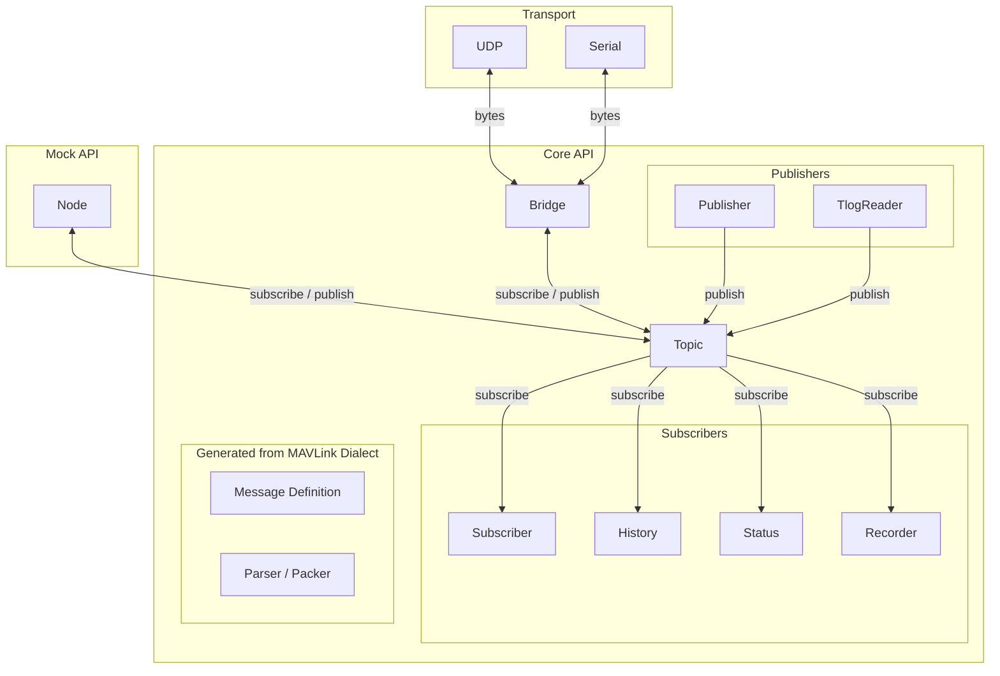
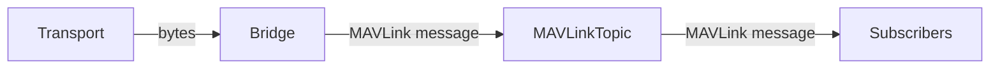
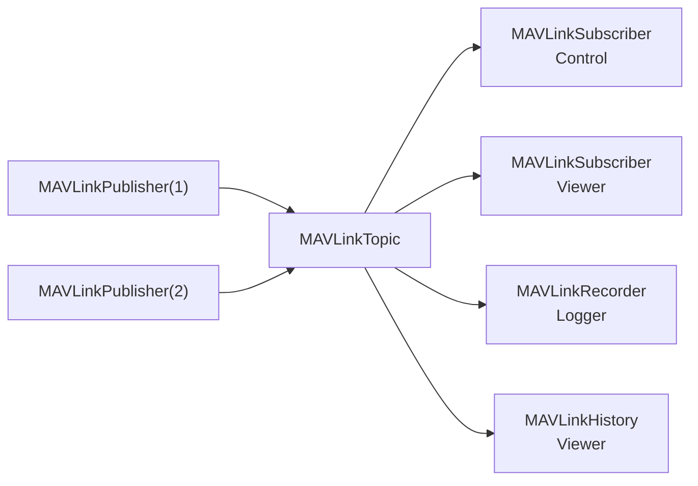
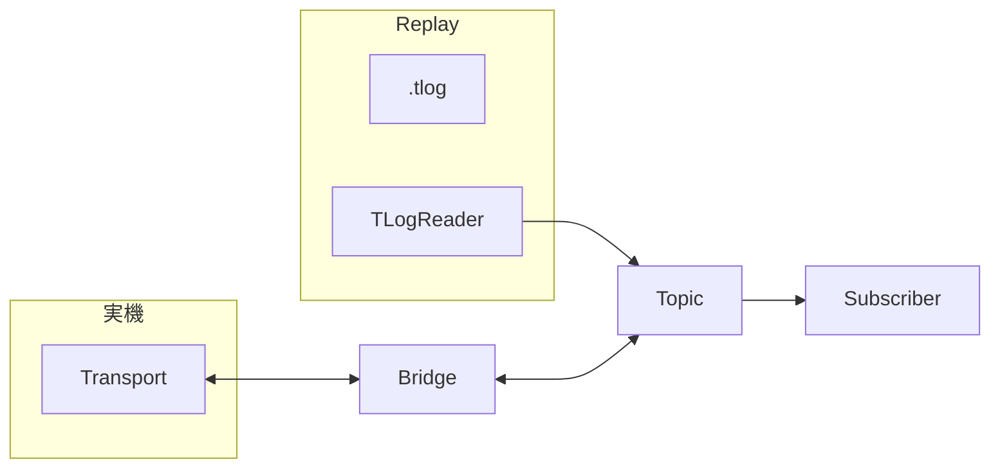

# mavlink-python

MAVLinkを利用した通信・データ処理システムを構築するためのPythonライブラリです。

`mavlink-python` は、MAVLinkメッセージの送受信だけでなく、メッセージの購読、履歴管理、ログ保存、リプレイなど、MAVLinkを利用するアプリケーションに必要となる機能を提供します。

シミュレーション、Software-in-the-Loop Simulation（SILS）、Hardware-in-the-Loop Simulation（HILS）をはじめ、実機を用いた通信・データ処理にも利用できることを目指しています。

## 特徴

- MAVLink dialectに基づくメッセージの送受信
- Publisher / Subscriberによるメッセージ配信
- マルチスレッド環境を考慮したデータアクセス
- MAVLink telemetry log（`.tlog`）形式でのログ保存
- コア機能を軽量に保った構成
- 通信媒体をTransportとして抽象化
- 受信したメッセージの履歴管理
- 保存したMAVLinkデータのリプレイ

MAVLinkのメッセージ定義と、通信・データ処理の機能を分離していることが本ライブラリの主要な設計方針です。

## インストール

バージョンが$(tag)のmavlink-pythonをインストールするには、以下を実行してください。

```bash
pip install https://github.com/TeamMeltingPoppo/mavlink-python/releases/download/$(tag)/mavlink-$(tag)-py3-none-any.whl
```

## 基本的な使い方

MAVLinkTopicを使用してMAVLinkメッセージを受信できます。

具体的なAPIについては、API Referenceを参照してください。

## アーキテクチャ

`mavlink-python` は、MAVLinkメッセージの定義、通信、メッセージの配信、アプリケーションによる処理を分離した構成になっています。

全体の構成は以下のようになります。



MAVLink Dialectは、MAVLinkで使用するメッセージの定義を提供します。MAVLink Code GeneratorによってPythonのMAVLinkモジュールを生成し、`mavlink-python` はそのモジュールを利用してメッセージのエンコード・デコードを行います。

Transportは、UDPやSerialなどの通信媒体とのデータの送受信を担当します。Transport自体はMAVLinkメッセージの意味を扱わず、通信媒体から得られたバイト列をMAVLinkTopicへ渡します。

MAVLinkTopicは、Transportとアプリケーションの間に位置し、受信したデータをMAVLinkメッセージとして処理します。



この構成により、アプリケーションは特定の通信媒体を直接扱う必要がありません。

例えば、シミュレーションではUDPを使用し、実機ではSerialを使用する場合でも、アプリケーション側では同じMAVLinkメッセージとして扱うことができます。

### Message Distribution

MAVLinkTopicで受信したメッセージは、Publisher / Subscriberモデルによってアプリケーションへ配信されます。



1つのMAVLinkメッセージを複数のSubscriberから独立して利用できるため、通信処理とアプリケーションの処理を分離できます。

例えば、同じIMUメッセージを制御処理、GUI、ロギング処理からそれぞれ利用できます。


### Transport

通信処理はTransportとして抽象化されています。

```text
Application
     │
     ▼
MAVLinkTopic
     │
     ▼
Transport
     │
     ├── UDP
     ├── Serial
     └── ...
```

MAVLinkTopicは特定の通信媒体に依存せず、Transportを介してデータを送受信します。

そのため、同じアプリケーションをシミュレーション環境と実機環境の両方で利用できます。


### Logging and Replay

ログ保存とリプレイも、MAVLinkTopicを中心とした同じデータフローの上に構築されます。



この構成により、実際の通信から取得したデータと、ログからリプレイしたデータを、MAVLinkTopicの下流では同じMAVLinkメッセージとして扱うことができます。

そのため、実機で取得したデータを使って、通信相手やハードウェアを用意せずにViewerや解析処理を動作させることができます。

この特性により、解析だけでなくSILS、HILSなどにもログを利用できます。


## MAVLink Dialect

`mavlink-python` 自体ではMAVLinkのメッセージを定義しません。

MAVLink dialectからコード生成ツールによってPythonのMAVLinkモジュールを生成し、それを `mavlink-python` から利用します。

```text
MAVLink Dialect
      │
      ▼
Generated MAVLink module
      │
      ├── Message definitions
      ├── Encoder / Decoder
      └── mavlink_map
              │
              ▼
        mavlink-python
              │
              ├── Transport
              ├── Publisher / Subscriber
              ├── History
              └── Logging / Replay
```

この構成により、MAVLinkのメッセージ定義と、それを利用するアプリケーションの機能を分離できます。

## 設計方針

`mavlink-python` では、以下の分離を重視しています。

1. MAVLinkのメッセージ定義とアプリケーションを分離する
2. 通信媒体とメッセージ処理を分離する
3. メッセージの送受信とアプリケーションによる処理を分離する
4. 記録したMAVLinkデータを、通信入力と同じように再利用できるようにする
5. コアパッケージの依存関係を最小限にする

本ライブラリは、Ground Control Station（GCS）やフライトスタックそのものを置き換えることを目的としていません。

MAVLinkを利用したシステムを構築するための、通信・データ処理の基盤を提供することを目的としています。

## 想定する用途

`mavlink-python` は、例えば次のような用途で利用できます。

- SILS / HILS / MILS
- フライトデータロギング
- テレメトリの可視化
- 実機試験
- センサーデータ解析
- 通信試験
- MAVLink通信のリプレイ