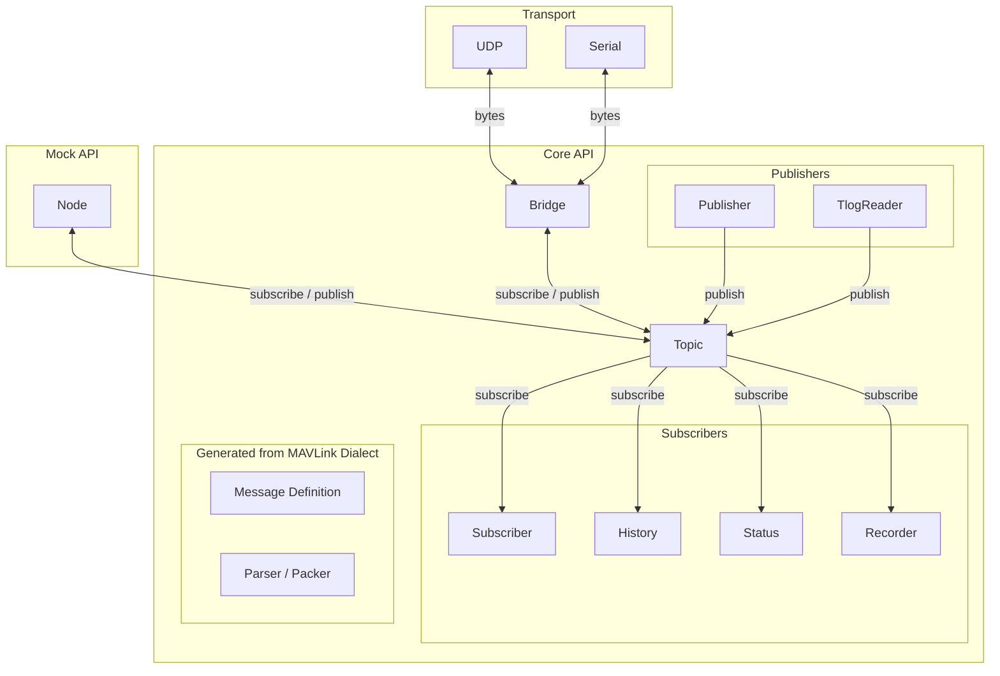
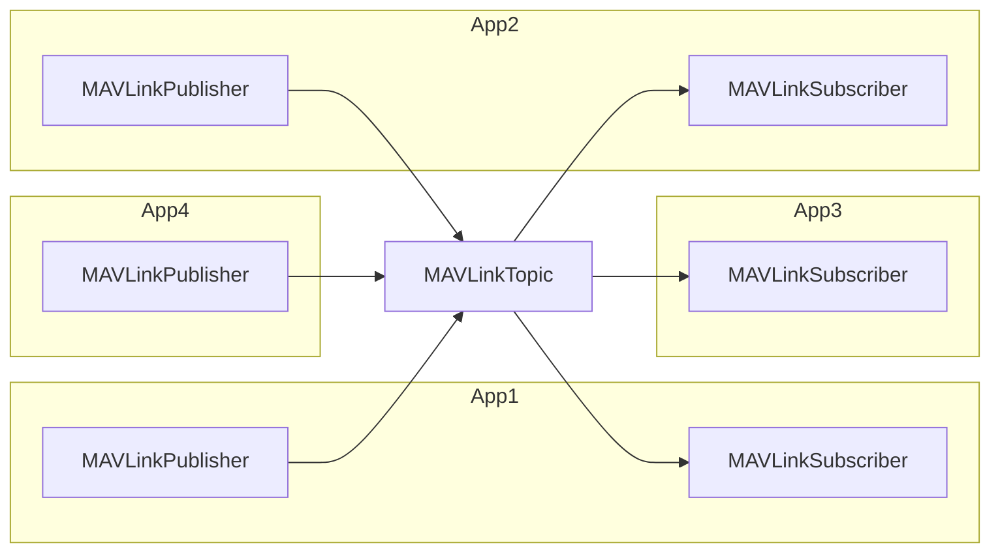
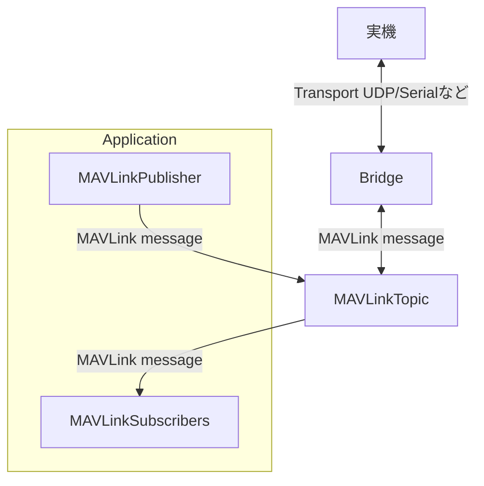
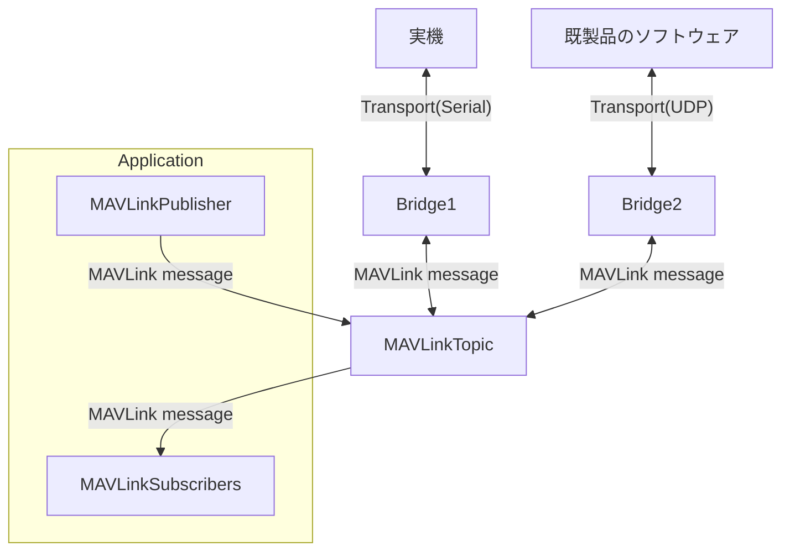
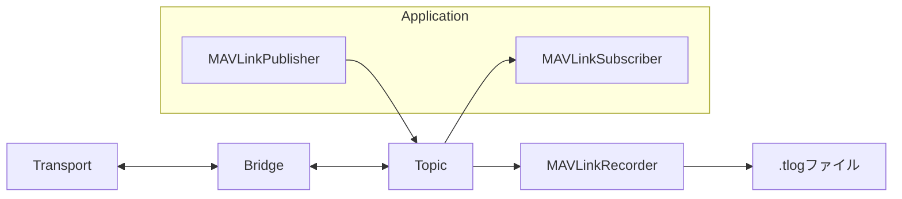
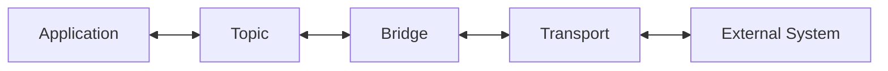

# アーキテクチャ

`mavlink-python` は、MAVLinkメッセージの定義、通信、メッセージの配信、アプリケーションによる処理を分離した構成になっています。

全体の構成は以下のようになります。



`mavlink-python` の主要な構成要素は以下の通りです。

| 構成要素 | 役割 |
| --- | --- |
| `Node` | アプリケーションの実行単位 |
| `MAVLinkTopic` | MAVLinkメッセージを交換するための中心的なインターフェース |
| `Publisher` | Topicへメッセージを送信する |
| `Subscriber` | Topicからメッセージを受信する |
| `History` | Topicで扱われたメッセージの履歴を扱う |
| `MAVLinkBridge` | TopicとTransportを接続する |
| `Transport` | 外部の通信経路との送受信を担当する |
| `Recorder` | Topicのメッセージをログへ記録する |
| `TLogReader` | テレメトリログからメッセージを読み出す |

Transportは、UDPやSerialなどの通信媒体とのデータの送受信を担当します。Transport自体はMAVLinkメッセージの意味を扱わず、通信媒体から得られたバイト列をMAVLinkTopicへ渡します。

## Topic

`MAVLinkTopic` は、ライブラリ内でMAVLinkメッセージを交換するための中心的な
インターフェースです。

アプリケーションは、SerialやUDPなどの通信方式を直接扱わず、
`MAVLinkTopic` を介してメッセージを送受信します。



## Publisher / Subscriber

`Publisher` はTopicへMAVLinkメッセージを送信し、
`Subscriber` はTopicからMAVLinkメッセージを受信します。

Subscriberは購読条件を指定できるため、特定のSystem ID、
Component ID、Message IDなどに限定してメッセージを受信できます。

## BridgeとTransport

`MAVLinkBridge` は、`MAVLinkTopic` と `Transport` の間を接続します。

`Transport` はSerialやUDPなど、特定の通信方式によるデータの送受信を担当します。
一方、MAVLinkBridge はTransportとTopicの間でMAVLinkメッセージを受け渡します。

この分離によって、アプリケーションは通信方式を意識せずにMAVLinkメッセージを扱うことができます。



さらに、1つの `MAVLinkTopic` には複数のBridgeを接続できます。

例えば、同じTopicをSerialとUDPの両方に接続できます。

これにより、実機との通信とネットワークへの配信を、アプリケーション側の処理を変更せずに組み合わせることができます。



## Node

`Node` はアプリケーションの実行単位です。

NodeはTopicからPublisherやSubscriberを作成し、アプリケーション固有の処理を実装します。

`Node` の具体的な用途や実装方法は利用するシステムによって異なるため、本ライブラリでは特定のNode実装を提供しません。

`examples/mock_node.py` にNodeの実装例を示しています。


## ロギング

`Recorder` はTopicで扱われるMAVLinkメッセージをテレメトリログとして記録します。

Recorderをアプリケーションの通信処理から分離することで、既存のメッセージ処理を変更せずに通信内容を記録できます。



## TLogReader

`TLogReader` はテレメトリログを逐次読み込み、`(timestamp, message)` の形式でMAVLinkメッセージを提供します。

```python
reader = TLogReader("flight.tlog")

for timestamp, message in reader:
    ...
```

`TLogReader` はログの読み出しを担当し、データ分析や可視化などは担当しません。

## アプリケーションと通信の分離

`mavlink-python` では、アプリケーションが通信方式に依存しない構成を基本とします。



そのため、同じアプリケーションをSerial、UDPなど異なる通信方法で接続させることができます。

また、Recorder によって実機で取得したデータを保存し、TLogReader によって保存したデータをアプリケーション側で利用できます。

この構成により、実機通信・シミュレーション・試験・ログ取得などで
共通のメッセージングモデルを利用できます。